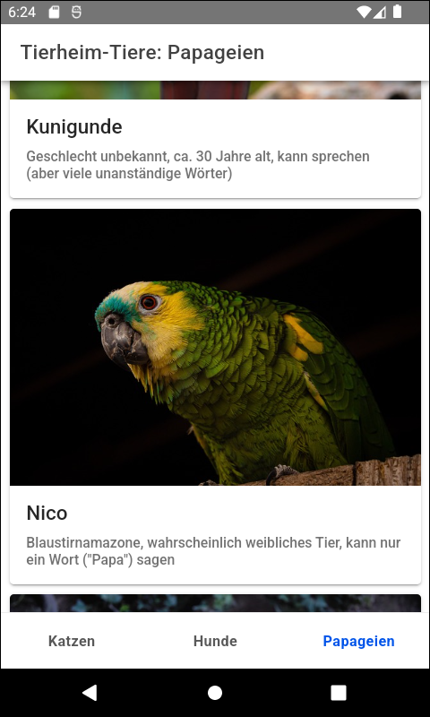

# Ionic-App "Tierheimtiere" #

 

This repository contains an [Ionic app](https://ionicframework.com/) with [Angular](https://angular.io/) that demonstrates how
[ion-tabs](https://ionicframework.com/docs/api/tabs) can be used.

 

----

## Screenshot ##

 

 

The screenshot shows part of [photo no 7393413](https://pixabay.com/photos/parrot-bird-perched-animal-7393413/) on pixabay.com by [Oto_Boxler](https://pixabay.com/users/oto_boxler-26162471/).

 

----

## License ##

 

See the [LICENSE file](LICENSE.md) for license rights and limitations (BSD 3-Clause License) for the files in this repository.

 

In folder [src/assets/](src/assets) this Git repository contains some animal pictures published on [pixabay.com](https://pixabay.com/).
The photographers of the animal pictures are mentioned on the bottom of each of the tabs shown by the application.

 
