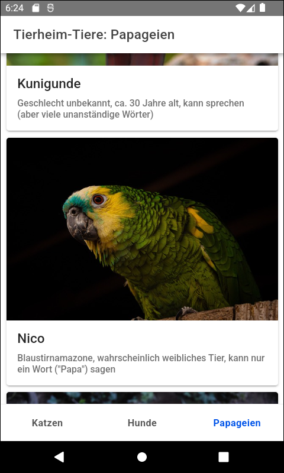

# Ionic-App "Tierheimtiere" #

 

Dieses Repository enthält eine [Ionic-App](https://ionicframework.com/) mit [Angular](https://angular.io/), die demonstriert, wie
[ion-tabs](https://ionicframework.com/docs/api/tabs) verwendet werden können.

 

----

## Screenshot ##

 

 

Der Screenshot zeigt einen Teil von [Foto Nr. 7393413](https://pixabay.com/photos/parrot-bird-perched-animal-7393413/) auf pixabay.com 
von [Oto_Boxler](https://pixabay.com/users/oto_boxler-26162471/).

 

----

## License ##

 

See the [LICENSE file](LICENSE.md) for license rights and limitations (BSD 3-Clause License) for the files in this repository.

 

Im Ordner [src/assets/](src/assets) enthält dieses Git-Repository einige Tierbilder, die auf [pixabay.com](https://pixabay.com/) veröffentlicht wurden.  
Die Fotografen der Tierbilder werden am unteren Rand jeder von der Anwendung angezeigten Registerkarte erwähnt.

 
